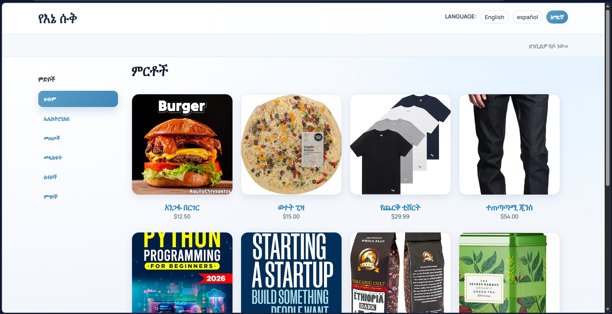
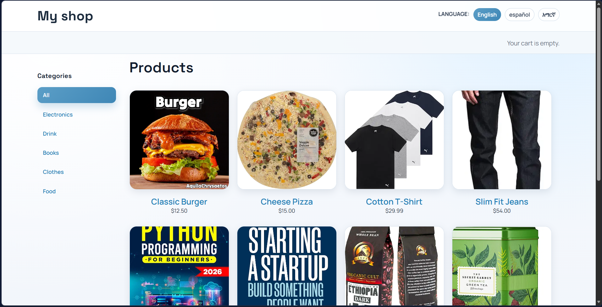
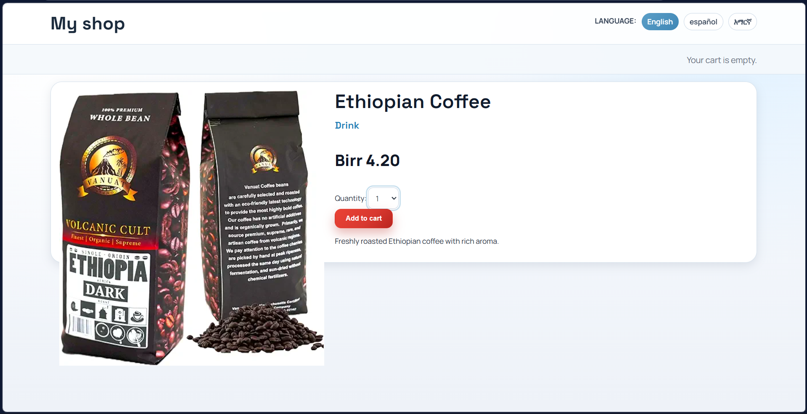
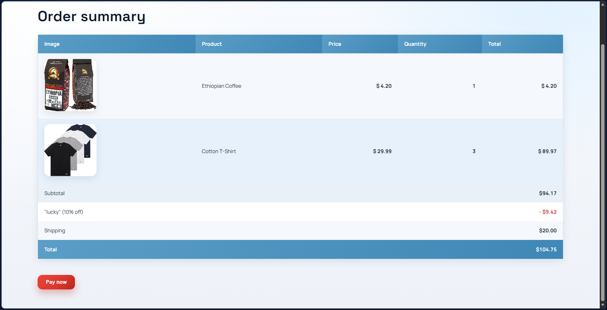
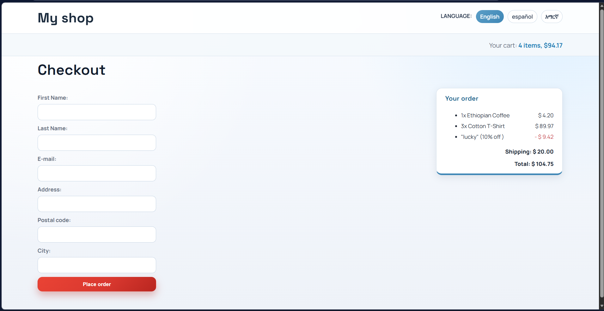
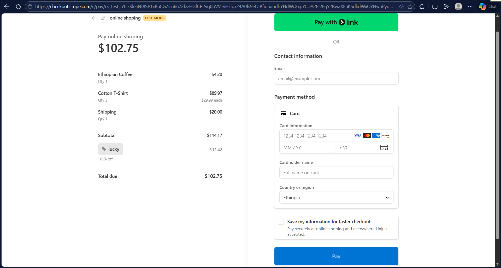
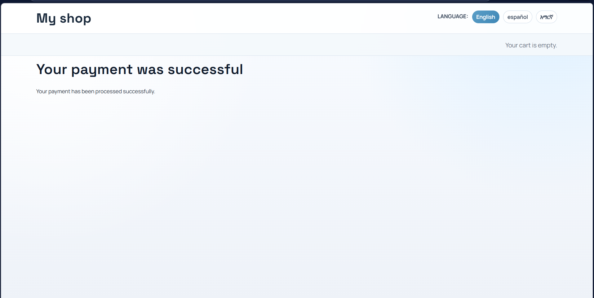
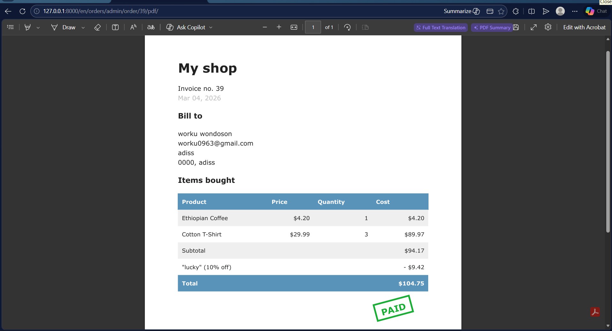

# My Shop | Django E-commerce Platform

My Shop is a full-stack e-commerce web application built with Django that demonstrates production-style commerce workflows: localized storefronts, cart and coupon logic, weighted shipping, Stripe checkout, webhook-based payment verification, invoice generation, and asynchronous processing with Celery.

## Project Highlights
This project demonstrates practical backend and product engineering capability in one codebase:
- End-to-end checkout and payment lifecycle
- Real business rules (discounting, shipping tiers, validation)
- Third-party payment integration with secure webhook handling
- Asynchronous task execution for post-payment operations
- Recommendation engine using Redis co-purchase scoring
- Admin tooling for operations and reporting

## Business-Focused Features

### Customer Experience
- Localized storefront and URLs (`en`, `es`, `am`)
- Product catalog, category browsing, and product detail pages
- Session-based cart (add/update/remove)
- Coupon application with active-date validation
- Shipping fee based on total order weight
- Stripe hosted checkout flow

### Operations and Backoffice
- Admin management for products, categories, coupons, and orders
- CSV export for order data
- Invoice PDF generation
- Post-payment invoice email task via Celery
- Order payment state updates from Stripe webhooks

## System Workflow
1. Customer adds products to cart.
2. Customer optionally applies a coupon.
3. Checkout creates order and order items, computes shipping.
4. Payment page creates Stripe Checkout session.
5. Stripe webhook confirms payment and marks order as paid.
6. Celery task generates and emails invoice PDF.
7. Redis recommendation scores are updated from paid order items.

## End-to-End Product Flow

|     (Spanish UI) |  (Amharic UI) |
| --- | --- |
| Spanish UI | Amharic UI |
|  |  |

|     |     |
| --- | --- |
| Home page | Order detail page |
|  |  |

|     |     |
| --- | --- |
| Ordered items table | Checkout page |
|  |  |

|     |     |
| --- | --- |
| Stripe checkout | Payment completed |
|  |  |

|     |  |
| --- | --- |
| Admin invoice PDF view |  |
|  |  |

## Tech Stack
- Python 3.13
- Django 6.0.1
- Celery 5.6.2
- Redis
- Stripe API
- WeasyPrint
- django-parler
- django-rosetta
- django-localflavor
- SQLite (default)

## Local Setup (PowerShell)

### 1. Create environment and install dependencies
```powershell
cd C:\Users\hi\Downloads\webdev\Django_Projects\onlineShop
python -m venv env\myshop
.\env\myshop\Scripts\Activate.ps1
pip install -r myshop\requirements.txt
```

### 2. Run database setup and app
```powershell
cd myshop
python manage.py migrate
python manage.py createsuperuser
python manage.py runserver
```

### 3. Start supporting services
```powershell
# Terminal 2: Redis
redis-server
```

```powershell
# Terminal 3: Celery worker (Windows-safe command)
cd myshop
..\env\myshop\Scripts\python.exe -m celery -A myshop worker -l info -P solo
```

```powershell
# Terminal 4: Stripe webhook forwarding
stripe listen --forward-to http://127.0.0.1:8000/payment/webhook/
```

### 4. Environment variables
Create `myshop/.env`:
```env
STRIPE_PUBLISHABLE_KEY=pk_test_...
STRIPE_SECRET_KEY=sk_test_...
STRIPE_WEBHOOK_SECRET=whsec_...
```

## Repository Structure
```text
onlineShop/
  README.md
  docs/
    image/
  myshop/
    manage.py
    requirements.txt
    myshop/           # settings, urls, celery config
    shop/             # catalog + recommendations
    cart/             # cart logic
    coupons/          # discount rules
    orders/           # order creation + invoice support
    payment/          # stripe process + webhook handlers
    locale/           # multilingual content
```

## Professional Context
This repository is maintained as a professional GitHub showcase of my work. It demonstrates hands-on ability to build and connect systems common in production commerce products: transactional flows, payment integrations, asynchronous processing, internationalization, and operational admin tooling.
